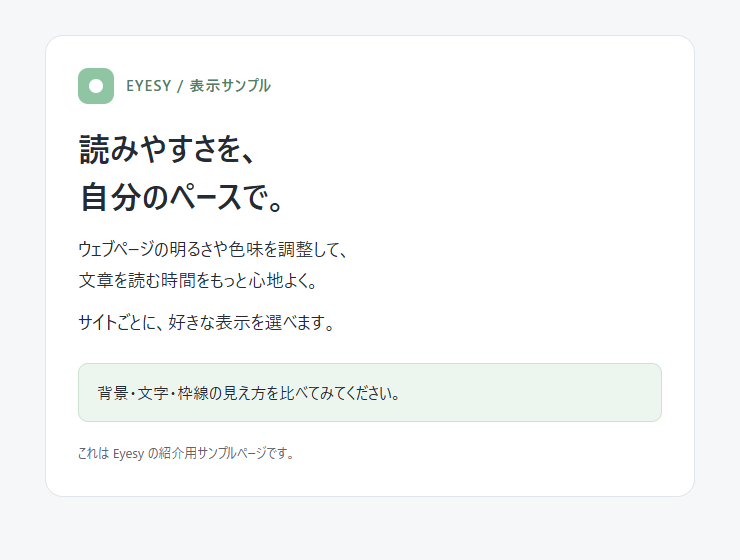
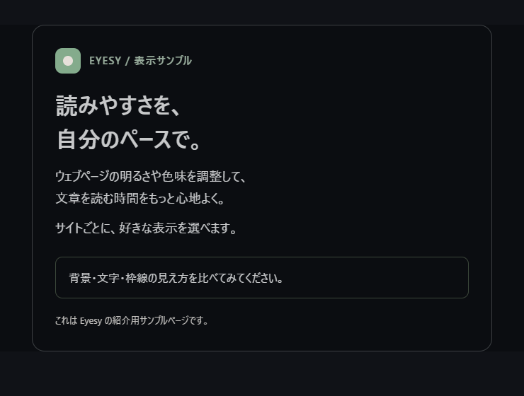
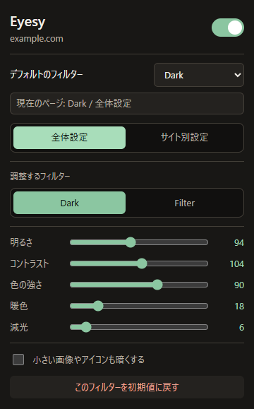

# Eyesy

**明るすぎるウェブページを、自分に合った見た目へ。**

Eyesy は、ウェブページを暗い配色に変えたり、明るさや色味を調整したりできる Chrome 拡張機能です。普段の設定を全サイトに使いつつ、サイトごとに見やすさを調整できます。

作者：[Goemon（@Goemon_Tokyo）](https://x.com/Goemon_Tokyo)

[インストール](#インストール) · [使い方](#使い方) · [プライバシー](PRIVACY.md) · [開発への参加](CONTRIBUTING.md)

## 表示例

紹介用の同じサンプルページを、Normal と Dark で表示した例です。

| Normal | Dark |
| --- | --- |
|  |  |

## できること

| 表示モード | 使いどころ |
| --- | --- |
| **Dark** | 白い背景や暗い文字を、暗い背景と明るい文字に変えたいとき |
| **Filter** | サイト本来の配色を生かして、まぶしさや色味を調整したいとき |
| **Normal** | サイト本来の表示で使いたいとき |

- **細かな調整** — 明るさ、コントラスト、色の強さ、暖色、減光を調整できます。
- **全体設定とサイト別設定** — Dark と Filter の調整を別々に保存し、必要なサイトだけ個別に上書きできます。
- **小さな画像の調整** — 小さい画像やアイコンを追加で暗くできます。
- **キーボード操作** — 現在のサイトの表示や、Eyesy 全体のオン・オフを切り替えられます。

## インストール

デスクトップ版 Google Chrome で、フォルダを読み込む方法で利用できます。

1. このページ上部の **Code → Download ZIP** を選び、ダウンロードした ZIP を展開します。
2. Chrome のアドレスバーに `chrome://extensions/` と入力して開きます。
3. 右上の **デベロッパー モード** をオンにします。
4. **パッケージ化されていない拡張機能を読み込む** を押します。
5. 展開したフォルダのうち、`manifest.json` が入っているフォルダを選びます。
6. ツールバーの拡張機能メニューから Eyesy を固定すると、設定を開きやすくなります。

読み込んだフォルダは、利用中も同じ場所に保存してください。インストール後、既に開いていたウェブページを再読み込みすると、設定が反映されます。

### 更新するには

新しいソースコードを同じフォルダに配置し、`chrome://extensions/` の Eyesy の再読み込みボタンを押します。その後、利用中のウェブページも再読み込みしてください。

## 使い方

設定画面を見る

### 普段の見た目を決める

1. ウェブページを開き、ツールバーの Eyesy を押します。
2. **デフォルトのフィルター** から、普段使う Dark・Filter・Normal を選びます。
3. **全体設定** で調整するフィルターを選び、スライダーで好みの色味にします。

「調整するフィルター」は、編集する設定の切り替えです。実際の表示モードは、上部の「デフォルトのフィルター」またはサイト別設定で選びます。

初期設定は Dark です。ヘッダー右側のスイッチで、Eyesy 全体をオン・オフできます。

### このサイトだけ変える

**サイト別設定 → 今のサイトの表示** で、表示モードを選びます。

- **全体に従う**：デフォルトのフィルターを使います。
- **Dark / Filter / Normal**：このサイトの表示を指定します。
- **このサイトだけ細かく調整**：このサイト用にスライダーの値を保存します。
- **このサイトの設定を消す**：表示モードと個別の調整を消し、全体設定に戻します。

サイトはホスト名単位で扱います。例えば `example.com` と `app.example.com` は別々の設定になります。

### キーボードショートカット

| 操作 | Windows / Linux | macOS |
| --- | --- | --- |
| 現在のサイトをオン・オフ | `Alt+Shift+2` | `Command+Shift+2` |
| Eyesy 全体をオン・オフ | `Alt+Shift+3` | `Command+Shift+3` |
| 現在のサイトを Dark → Filter → Normal の順に切り替え | `Alt+Shift+4` | `Command+Shift+4` |

デフォルトが Normal のとき、サイトのオン・オフ操作で有効にすると Dark になります。Eyesy 全体がオフの場合は、全体をオンにしてから表示を確認してください。

キーがほかの操作と重なる場合は、`chrome://extensions/shortcuts` で割り当てを変更できます。

## 対応範囲と表示の調整

対象は `http://` と `https://` のウェブページです。Chrome の設定画面、Chrome Web Store など拡張機能の実行が制限されるページ、および `file://` で開くローカルファイルは対象外です。

Dark はページ内の背景・文字・枠線などを変換します。サイト独自の描画や、画像・動画・Canvas・一部の埋め込み要素では変換結果が異なります。

- 配色が合わないサイトでは、**Filter** または **Normal** を選んでください。
- サイト自身のダークモードや、ほかの色調整拡張機能を併用すると、効果が重なる場合があります。
- 「小さい画像やアイコンも暗くする」は、幅・高さがともに 160px 以下と判定された画像や SVG が主な対象です。

## 必要な権限

| 権限 | 使う理由 |
| --- | --- |
| ウェブサイトへのアクセス（HTTP / HTTPS） | ページの配色を調整し、現在のサイトに合った設定を使うため |
| `storage` | 表示モードや色味、サイト別設定を保存するため |
| `scripting` | 拡張機能の更新後など、開いているページに処理を読み込み直すため |

Chrome の拡張機能設定でサイトへのアクセスを制限した場合は、許可したサイトで利用できます。

## プライバシー

配色の変換は、開いているページ内で行います。保存するのは表示設定と、個別設定したサイトのホスト名です。

設定には Chrome の `storage.sync` を使用しています。**Chrome の同期が有効な場合、サイト別設定を含む設定データが Chrome の同期機能を通じて共有されます。** 保存する内容と削除方法は [プライバシーについて](PRIVACY.md) にまとめています。

## 開発・不具合報告

HTML・CSS・JavaScript と Chrome の拡張機能 API で構成しています。ソースコードのフォルダをそのまま Chrome に読み込んで開発できます。

不具合や改善案は、このリポジトリの **Issues** にお寄せください。再現手順や確認項目は [CONTRIBUTING.md](CONTRIBUTING.md) をご覧ください。

## 作者・お問い合わせ

Eyesy は [Goemon（@Goemon_Tokyo）](https://x.com/Goemon_Tokyo) が開発しています。

個別のご相談・お問い合わせは、[X の DM](https://x.com/Goemon_Tokyo) へお寄せください。不具合報告や改善案は、このリポジトリの **Issues** でも受け付けています。

[公式 GitHub リポジトリはこちら](https://github.com/goemon-labs/Eyesy)です。Eyesy が役に立ったら、Star を付けていただけると励みになります。再利用や紹介の際に、公式リポジトリへのリンクを添えていただけるとうれしいです。

## ライセンス

[MIT License](LICENSE) — Copyright (c) 2026 goemon-biz
